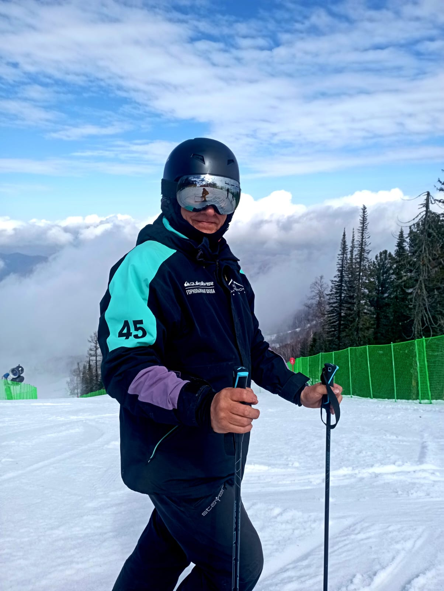

<!DOCTYPE html>
<html lang="ru">
  <head>
    <meta charset="utf-8">
    <meta name="viewport" content="width=device-width, initial-scale=1.0">
    <title> Немного обо мне</title>       
  </head>
  <body>
    <header>
      <h1>Немного обо мне</h1>
      
Меня зовут Рашид Морозов. 
       Сейчас я занимаюсь изучением языка программирования Python, пытаюсь паралельно познакомиться с JS. Немного знаком с html.  
       А вот чем еще я увлекаюсь кроме программирования:

      <nav>
        <ul>
          <li>Решаю шахматные задачки</li>
          <li>Неплохо катаюсь на горных лыжах</li>
          <li>Альпинизм</li>
          <li>Пчеловодство</li>
        </ul>
      </nav>
    </header>
    <main>
      <article>
        <section>
          <h2>Это я</h2>        
          
          
Зимой работаю инструктором по горным лыжам.

        </section>
        <section>
          <h2>Мои успехи, достижения и т.д.

        </section>        
      </article>
    </main>
    <footer>
      
Сюда я потом добавлю ссылку на портфолио и  другие полезные ссылки

    </footer>
    
  </body>
</html>